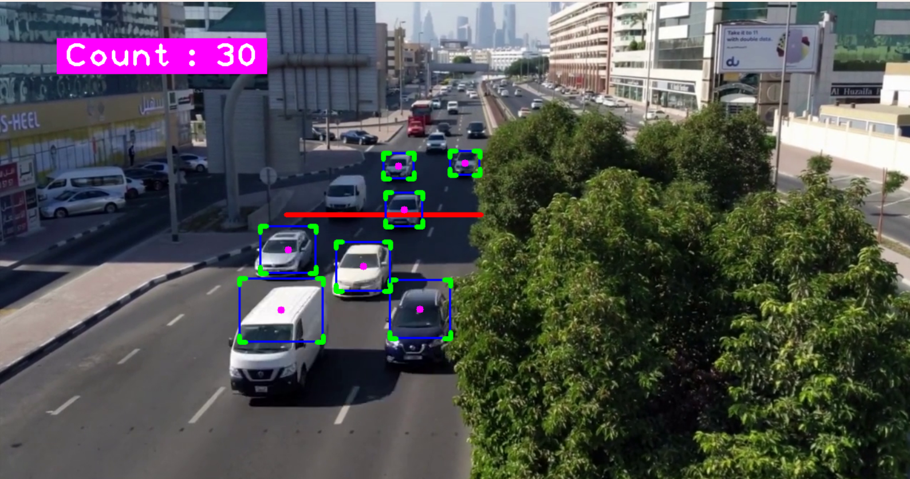

# Car counter

This is a car counter app that can be implemented to count cars in a video feed or real time web cam based on AI made using opencv and yolo libraries


## Installation

Use the package manager [pip](https://pip.pypa.io/en/stable/) to install some of the libraries.

```bash
pip install cvzone
pip install ultralytics
pip install hydra-core
pip install matplotlib
pip install numpy
pip install opencv-python
pip install scikit-image
pip install filterpy
pip install torch
```

## Screenshots



